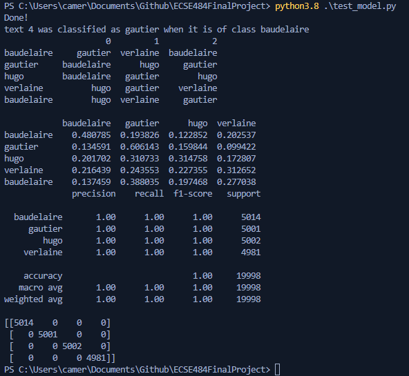

## Introduction

Machine learning has proved to be a great tool for classifying images. Recently there has also been a lot of research on text classification as well. However, most of the research has been mostly focused on English examples only. While this gave us great advances in the field, it also is very limiting as for the datasets available but there is also the risk of building models with heavy biases inherent to the english language.

## Problems

The idea of our project is to take poems from different authors of the same literary era and identify who the author is based on the writing. All the authors would be picked from the same century and since the literary movement would be the same, we hope to make it so that the only difference would be the actual writing itself rather than the style and emotion behind. In addition our project will be looking at French authors whose language is well supported in the field of natural language processing and whose works are well documented.

## Dataset

A dataset of french poem doesn't really exist so we went to create our own. Using the **Gutenberg project**, we used the text versions of the following collections of poems: **Les Fleurs du Mal** de *Charles Baudelaire*, **Les contemplations: Autrefois, 1830-1843** de *Victor Hugo*, **Œuvres complètes - Volume 1** de *Paul Verlaine*, and **La Comédie de la mort** de *Théophile Gautier*.
After downloading each collection, we used a custom script `text_splitter.py` to split each into separate poems blocks that we would then use to train our model. After doing some statistics, we saw that most poems were in between 70 and 140 words long and split each block so that they would be 100 words long and created 10000 examples for each class.
Each block was placed inside a folder representing its label.

## Methods

With the datasets ready we began to search for the most optimal environment in which to classify the authors. Tensorflow was an option but seemed somewhat limited in scope but sklearn did not handle neural network text classification well.  We decided to try both options regardless with Tensorflow being the only successful neural network we could apply. To tokenize our dataset we made use of Spacy. Spacy is a natural language processing tool in python that can recognize multiple languages, French being one of them. It allows for the recognition of stop words so that we can properly vectorize our model. We tested two different options in respect to tokenization one being sentences the other words. Testing both options proved words to be the better choice for tokenization. Once we decided on a vectorization for our datasets we began to construct and train our model. Deciding on a total of five layers with a sigmoid activation function, as that is the recommended amount for a text classification model with a final layer to allow for multi-classifcation output. The first layer acted as a transitional layer for our vectorized dataset, effectively initiating word embedding. The second and fourth layers were both dropout layers to help prevent overfitting. The third is a average pooling layer to handle variable length inputs. The fifth and final layer is a densely connectected layer which we connected to four output nodes.

Since we were having difficulty using sklearn multi-classification neural networks to function we decided to use sklearn in another field of machine learning.  Using sklearn we created a classification model, due to our labelled data and used multinomial naive bayes as our classification algorithm. Due to our dataset having multiple classes and being text files this decision was trivial. The parameters we chose to manipulate were the classifier alpha, fit prior, and vector ngram range. Each has a range of values we determined that would best fit our model and we used an inbuilt tool from sklearn to optimize our model to the best parameter choices. The best settings we could were: classifier value of 1.0, setting the classifier fit prior to true, and a vector ngram range of 2. Once both models were constructed and trained we began to test their prediction capabilities.

## Results

Once our model finished its classification it managed to fit our training datasets perfectly. We then collected a group of text files from each author to test our model's accuracy with untrained data. This is were things get complicated, since accuracy seemed to vary significantly between identified authors. Below is a an image of one set of captured results.  The bottom half of the image references the trained data accuracy (which are all values of 1.00).

The image shows that generally our model was able to classify the author correctly (save for one misclassification), but looking at the accuracy we can see Gautier generally having the highest confidence while Hugo and Verlaine have the lowest. This discrepancy in accuracy could be a result of many factors but one factor could be how different styles of authors changed. The model originally trained on a set of time-period work by the four authors, is not as precise identifying the prose of different periods. One example of this case is the misclassification of a Baudelaire piece to be Gautier.  This piece was significantly longer than previous pieces by the same author with a much more direct and expressive tone.  This shift in prose by Baudelaire is likely why this misclassification occurred.

Our current conclusion from this project is that classifying author prose is a difficult procedure. Their works can vary from poem to poem and distinct signatures from authors are very hard to come by. This was seen by many low confidence scores in our model testing and a somewhat confident misclassification on the models part. It may be more reasonable to classify works based on time period, style, or type (like sonnet, limerick, etc..).

## References

[1]“sklearn.naive_bayes.MultinomialNB — scikit-learn 1.0.2 documentation,” scikit-learn. https://scikit-learn.org/stable/modules/generated/sklearn.naive_bayes.MultinomialNB.html (accessed Apr. 27, 2022).

[2]“1.9. Naive Bayes — scikit-learn 1.0.2 documentation,” scikit-learn. https://scikit-learn.org/stable/modules/naive_bayes.html#multinomial-naive-bayes (accessed Apr. 27, 2022).

[3]“Poésie française - 5876 poèmes français célèbres,” Poésie française. https://www.poesie-francaise.fr (accessed Apr. 27, 2022).

[4]“Free eBooks | Project Gutenberg,” Project Gutenberg. https://www.gutenberg.org (accessed Apr. 27, 2022).

[5]“French · spaCy Models Documentation,” French. https://spacy.io/models/fr (accessed Apr. 27, 2022).
